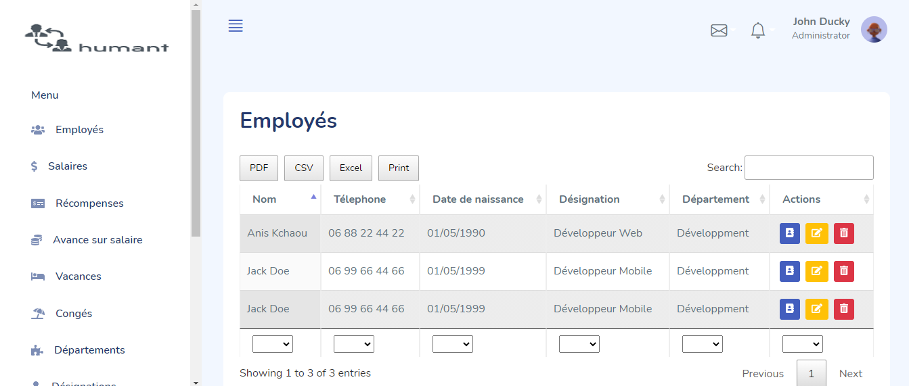

## Introduction

Humant is a tool for any company to manage details employees and employers. Humant is made in such a way that any employee either he is Manger or fresher can understand and able to use it.
Humant will make it easy for your HR team to start managing your HR effectively and efficiently. HRMS is an indispensable tool not just for HR but for the entire company

## Informations
-  Status: under development
-   Latest version 1.0
-   Sector: service
-   Created: November 2020
-   Last updated: November 2020

## Table of contents
* [Documentation](#general-info)
* [Demo](#demo)
* [Screenshots](#screenshots)
* [Technologies](#technologies)
* [Setup](#setup)
* [Features](#features)
* [Status](#status)
* [Contact](#contact)
* [License](#license)

## Documentation
https://github.com/aniskchaou/HUMANT-FRONTEND-ADMIN/wiki

## Demo
https://humant.herokuapp.com/

## Screenshots

## Technologies
* Spring boot
* Angular

## Setup

## Features
 - Collect and integrate the variable payroll elements of each employee
-   Maintain personnel files
-   Manage employment contracts (establishment, monitoring, suspension, termination)
-   Administratively manage leave and retirement of the employee
-   Produce an annual training plan corresponding to both the needs of the company and the development wishes of employees
-   Offer skills assessments

  

## Contact
contact@delta-dev-software.com

## License
<a href="license.txt">MIT License</a>