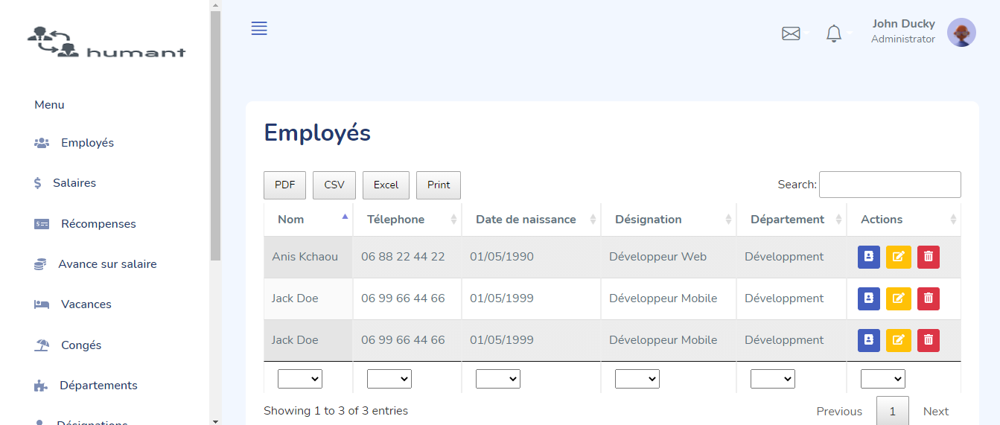

# HUMANT HRMS

<p align="center">
	
</p>

Humant is a full Human Resource Management System (HRMS) with an Angular frontend and Spring Boot backend. It helps organizations manage the employee lifecycle, recruitment, payroll-related workflows, leave, performance, communication, and compliance records in one platform.

## Product Summary

- Product Name: HUMANT
- Type: HRMS (Human Resource Management System)
- Frontend: Angular 11
- Backend: Spring Boot 2.5 (Java 11)
- Database: PostgreSQL (default) / MySQL (legacy config comments)
- Current Architecture: Monorepo with frontend at repository root and backend in `backend/`

## Core Features

- Employee profile and master data management
- Department, designation, and organization structure management
- Attendance, leave, holiday, and workforce administration
- Payroll-related workflows (salary, payslip, advance salary, loan, expense)
- Recruitment workflows (jobs, applications, pipeline, interview, offer letters)
- Contract, document, warning, complaint, notice, and termination workflows
- Training, event, onboarding, and communication modules
- Role-based security and protected backend APIs

## Module Documentation

Detailed module-by-module user guide, product details, local installation, and server deployment guide:

- [docs/MODULES_USER_GUIDE.md](docs/MODULES_USER_GUIDE.md)
- [docs/ROLE_BASED_USER_GUIDE.md](docs/ROLE_BASED_USER_GUIDE.md)

## Quick Start (Local)

### 1) Prerequisites

- Node.js 14.x or 16.x (recommended for Angular 11 compatibility)
- npm 6+ or 8+
- Java 11 (required by backend)
- Maven (optional if using wrapper; wrapper included)
- PostgreSQL 12+ (or compatible)

### 2) Clone and Install Frontend Dependencies

```bash
npm install
```

### 3) Configure Database

Backend default database configuration is in:

- `backend/src/main/resources/application.properties`

Default values:

- URL: `jdbc:postgresql://localhost:5432/humant`
- Username: `postgres`
- Password: `admin`

Create the database before starting backend:

```sql
CREATE DATABASE humant;
```

### 4) Run Backend

Windows (using Maven wrapper):

```powershell
Push-Location .\backend
.\mvnw.cmd spring-boot:run
```

Backend runs on:

- `http://localhost:8080`

### 5) Run Frontend

```bash
npm run serve -- --port 4201
```

Frontend runs on:

- `http://localhost:4201`

## Server Deployment (Production)

For production-ready instructions (backend service, reverse proxy, SSL, and rollout checklist), see:

- [docs/MODULES_USER_GUIDE.md](docs/MODULES_USER_GUIDE.md)

## Development Commands

- Start frontend dev server: `npm run serve -- --port 4201`
- Frontend build: `npm run build`
- Frontend tests: `npm run test`
- Start backend: `backend/mvnw spring-boot:run` (Linux/macOS) or `backend\mvnw.cmd spring-boot:run` (Windows)

## Screenshots

<p align="center">
	
</p>

## Documentation Links

- Old project wiki: https://github.com/aniskchaou/HUMANT-FRONTEND-ADMIN/wiki
- In-repo user guide: [docs/MODULES_USER_GUIDE.md](docs/MODULES_USER_GUIDE.md)
- In-repo role guide: [docs/ROLE_BASED_USER_GUIDE.md](docs/ROLE_BASED_USER_GUIDE.md)


## Contact

- Email: contact@delta-dev-software.com

## License

- [MIT License](license.txt)
